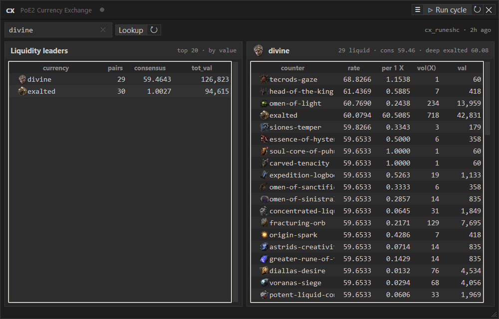

# poe2-cx

A little desktop cockpit for Path of Exile 2 trading, in one frameless window:

- **Currency** — the in-game Currency Exchange as a ranked dashboard: what's
  liquid, what each currency trades at, and how rates moved over the day, so
  you can size up trades before opening the in-game panel.
- **Uniques** — a unique-item browser: category → attribute (Str/Dex/Int for
  armour) or base → items by required level, with an in-game-style detail card.
  Double-click any unique (or its card's **↗ Open trade2**) to open a trade2
  search for it in the tracked league.
- **Trade** — a search builder for [pathofexile.com/trade2](https://www.pathofexile.com/trade2):
  pick category / rarity / level / price / stat filters (live search over the
  full stat dictionary), save named presets, and open them as pre-filled
  browser tabs.

## Data

Market data comes from [poe2scout](https://poe2scout.com), which re-serves the
official Currency Exchange data with a delay. Limitations:

- one rate per pair, not the real bid/ask spread (`lowest_ratio` / `highest_ratio`)
- ~1–3 h behind the live hour
- hourly bars, no individual trades

The tracked league is resolved from poe2scout on every cycle — the newest
current league, its Hardcore twin by default (`config.HARDCORE`); set
`config.LEAGUE_SHORT` to pin one by hand. Each league lives in its own Postgres
schema, so a league rotation is just the next **⇊ Actualize**.

A future version may use the official Currency Exchange API (`service:cxapi`)
for the full per-pair bid/ask range. It isn't open by default — you request it
from GGG (a personal, standalone client is fine: `oauth@grindinggear.com`).

The unique-item reference is merged from poe2scout too: its most complete
league list, then the current softcore league on top (poe2scout has no unique
data for Hardcore leagues, and a new league's list can stay empty for days).
Trade filter/stat dictionaries come from the official open `api/trade2/data/*`
endpoints.

## Trade presets — one-time browser setup

The short code in a trade2 URL is a server-side stored-query id: it can only be
minted by POSTing the query to the trade API, and that POST must come from a
real, logged-in browser (Cloudflare). So cx hands the query to your browser in
the URL fragment (`#cxq=…`), and a tiny userscript completes it:

1. Install [Tampermonkey](https://www.tampermonkey.net) in your default browser.
2. Open the raw script and click **Install**:
   `https://raw.githubusercontent.com/yaseminkaratas194149-sys/poe2-cx-dashboard/main/cx/trade_presets.user.js`
3. Be logged in on pathofexile.com. Done — tabs opened from cx turn into
   results by themselves (the script also adds its own preset panel on trade2
   pages).

## Run

    python -m cx              # GUI (Currency | Uniques | Trade)
    python -m cx --once       # one headless pull (the hourly cycle)
    python -m cx --actualize  # full refresh: league, pairs, backfill, uniques, trade dict
    python -m cx.backfill     # backfill pair history (last 24h)
    python -m cx.uniques      # refresh the unique-item reference (per patch)
    python -m cx.trade NAME   # open preset(s) from the CLI

In the window, **▷ Run cycle** is the hourly pull and **⇊ Actualize** the full
refresh — it also picks up a new league. The pin keeps cx above other windows;
unpin it to let the game cover cx, and run `python -m cx` again to call the
window back to the front (it is frameless, so it is in neither the taskbar nor
Alt-Tab).
